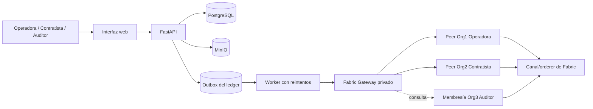

# FieldLedger

[](https://github.com/Garbox0/FIELDLEDGER/actions/workflows/ci.yml)

FieldLedger registra activos, trabajos de mantenimiento y evidencia entre una
operadora, una contratista y un auditor. PostgreSQL conserva los datos de
trabajo, MinIO guarda los archivos privados y Hyperledger Fabric registra los
hitos que las tres partes necesitan verificar.

El proyecto corre en una Raspberry Pi. Tiene interfaz web en español, una red
Fabric de tres organizaciones, chaincode, gateway privado, outbox
transaccional y verificación de documentos por SHA-256. Las operaciones que la
interfaz muestra como confirmadas provienen de transacciones reales de Fabric.

## Qué hay funcionando

- Alta y consulta de activos.
- Propuesta de mantenimiento por la contratista y aprobación o rechazo por la
  operadora.
- Entrega de cada cambio a Fabric mediante una outbox con reintentos e IDs
  idempotentes.
- Archivos privados en MinIO y sus huellas SHA-256 en el ledger.
- Consulta del ID de transacción y del bloque confirmado.
- Backups y controles de espacio pensados para la SD de la Raspberry Pi.

Es un prototipo funcional para portfolio y una posible base de piloto. Todavía
no es un sistema de producción.

## Arquitectura



Los bytes de los documentos nunca ingresan a Fabric. Solo se registran su
huella SHA-256 y metadatos compactos. Cada escritura requiere el aval de los
peers de la operadora y la contratista.

Consultar [PROJECT_STATE.md](PROJECT_STATE.md) para el relevo exacto,
[docs/technical-guide.md](docs/technical-guide.md) para la operación y
[docs/non-technical-guide.md](docs/non-technical-guide.md) para explicar el
proyecto a perfiles no técnicos.

## Puesta en marcha

Requisitos: Linux ARM64, Docker Engine con Compose v2, Make, Bash, Git, curl,
Python 3, jq, tar y OpenSSL.

```bash
make bootstrap
make ledger-up
make seed
make ledger-status
curl -fsS http://127.0.0.1:8095/ready
```

La aplicación se abre en `http://127.0.0.1:8095/app/` y OpenAPI en `/docs`.
Ambas se vinculan únicamente a loopback. Para acceder desde otra computadora,
crear un túnel sin publicar el servicio:

```bash
ssh -L 8095:127.0.0.1:8095 usuario@host-raspberry
```

PostgreSQL, MinIO y Fabric Gateway no publican puertos en el host.

## Interfaz web

La UI usa HTML, CSS y JavaScript nativos servidos por FastAPI. No agrega
framework, build de frontend, contenedor ni puerto. Incluye:

- login y cambio de identidad por rol;
- listado y detalle de activos;
- alta de activos para operadora/administrador;
- propuesta de mantenimiento para contratista;
- evidencia privada, aprobación y rechazo;
- actividad de la outbox con estado, transaction ID y bloque;
- verificación de PDF/JPEG/PNG contra Fabric.

El token se conserva en `sessionStorage`; la contraseña no se persiste. La UI
usa CSP sin scripts inline, bloqueo de frames y render seguro de datos
dinámicos.

Operaciones habituales:

```bash
make test             # ejecutar pruebas de la API Python
make migrate          # aplicar migraciones de Alembic
make ledger-reconcile # encolar registros creados antes de Fabric
make ledger-smoke     # commit real y verificación original/modificado
make ledger-status    # contenedores y estados de la outbox
make backup           # backup SHA-256 reservando 10 GiB de la SD
make storage-status   # uso de SD, backups, runtime de Fabric y Docker
make logs
```

`make bootstrap` genera secretos en un `.env` con permisos 600 y nunca
sobrescribe valores existentes. `.runtime` contiene identidades y material
generado de Fabric, y está excluido de Git.

## Superficie de la API

```text
POST   /api/v1/auth/login
GET    /api/v1/auth/me
POST   /api/v1/assets
GET    /api/v1/assets[/{asset_id}]
PATCH  /api/v1/assets/{asset_id}
DELETE /api/v1/assets/{asset_id}
POST   /api/v1/assets/{asset_id}/maintenance
GET    /api/v1/assets/{asset_id}/events
GET    /api/v1/events/{event_id}
POST   /api/v1/events/{event_id}/approve
POST   /api/v1/events/{event_id}/reject
POST   /api/v1/events/{event_id}/documents
GET    /api/v1/documents/{document_id}
POST   /api/v1/documents/verify
GET    /api/v1/ledger/operations
GET    /health
GET    /ready
```

El endpoint de verificación calcula el SHA-256 del archivo recibido y consulta
Fabric. Solo devuelve éxito cuando existe una coincidencia exacta en el
ledger. Si Fabric no está disponible, responde HTTP 502; no existe un fallback
local que simule éxito.

## Línea base verificada

Comprobada y desplegada el 14 de agosto de 2026:

| Componente | Versión |
|---|---:|
| Hyperledger Fabric | 2.5.16 LTS |
| Fabric Gateway Node SDK | 1.12.0 |
| Fabric chaincode API/shim | 2.5.8 |
| Imagen Node.js | 24.18.0-bookworm-slim |
| TypeScript | 7.0.2 |
| Imagen Python | 3.13.14-slim-bookworm |
| FastAPI | 0.141.1 |
| SQLAlchemy | 2.0.52 |
| Alembic | 1.19.1 |
| PostgreSQL | 18.4-bookworm |
| MinIO | RELEASE.2025-07-23T15-54-02Z |

La última aceptación en vivo confirmó los bloques 21 a 24, verificó el PDF
original y rechazó una copia modificada. Pasaron 15/15 pruebas Python, 2/2 del
chaincode y 2/2 del gateway. El 14 de agosto de 2026, `pip-audit` y ambos
`npm audit --omit=dev` informaron cero vulnerabilidades conocidas.

Fuentes de Fabric: [instalación y versiones](https://hyperledger-fabric.readthedocs.io/en/latest/install.html),
[notas de Fabric 2.5 LTS](https://hyperledger-fabric.readthedocs.io/en/release-2.5/whatsnew.html),
[documentación de test-network](https://hyperledger-fabric.readthedocs.io/en/release-2.5/test_network.html)
y [API de Gateway](https://hyperledger.github.io/fabric-gateway/main/api/node/interfaces/Contract.html).

## Limitaciones declaradas

- La topología Fabric deriva de la red educativa oficial `test-network`,
  ejecutada en un único host con tres organizaciones. No es infraestructura
  productiva.
- Todavía no existen telemetría MQTT, dashboards, despliegue continuo, OIDC,
  TLS de ingreso, alta disponibilidad, HSM ni recuperación externa.
- Se admite un documento primario por evento de mantenimiento.
- Los JWT no pueden revocarse antes de vencer y el login no tiene rate limit.
- El kernel de la Pi no aplica los límites de memoria declarados por Docker.
- El HDD conectado fue descartado: las escrituras sobre una región legible
  provocaron reinicios USB. Está desvinculado y en cuarentena por puerto hasta
  su reemplazo físico. Los datos permanecen en la SD; los backups reservan
  10 GiB y `make storage-status` advierte por debajo de 15 GiB.

## Límite de seguridad

Esta es una plataforma de laboratorio. No controla equipos de campo, no tiene
criptomoneda, token ni minería, no registra documentos completos ni telemetría
cruda en el ledger, no guarda secretos en Git y no publica rutas externas de
manera predeterminada. Consultar [SECURITY.md](SECURITY.md) antes de exponer o
adaptar el sistema.
