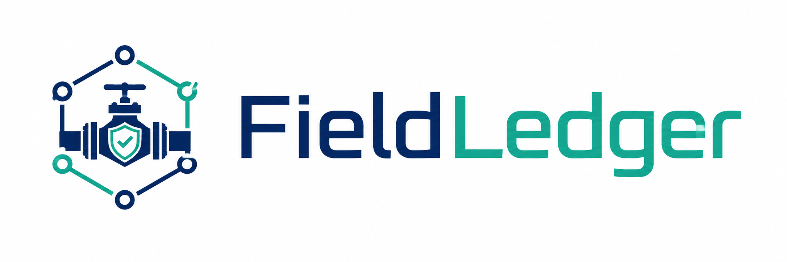
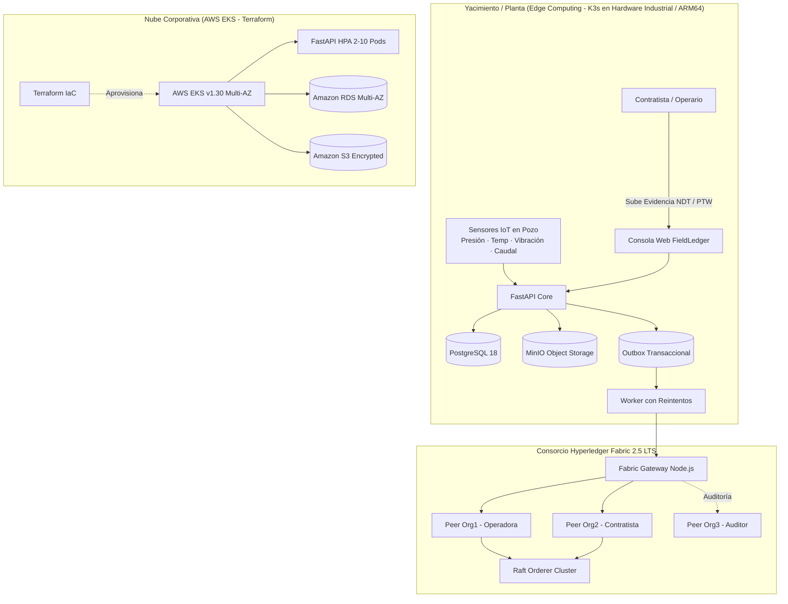

<div align="center">
  
  <h1>FieldLedger</h1>
  <p><strong>Integridad Operacional, Trazabilidad Inmutable & Telemetría Verificable en Oil & Gas</strong></p>
  <p>Consorcio de Hyperledger Fabric 2.5 LTS · Edge Computing con Kubernetes (K3s) · Terraform IaC · FastAPI</p>

  <p>
    <a href="https://fieldledger.aerosftp.com/app/"></a>
  </p>

  <p>
    
    
    
    
    
    
  </p>
</div>

---

## 📌 ¿Qué es FieldLedger?

En la industria de **Oil & Gas**, la operadora del yacimiento, las empresas contratistas de mantenimiento y los organismos de auditoría/reguladores comparten información crítica sobre pozos, bombas electrosumergibles, compresores y válvulas de seguridad.

Cuando ocurre un incidente, una falla mecánica o una auditoría ambiental, los registros en papel o en bases de datos centralizadas tradicionales son susceptibles de disputas, alteraciones retroactivas o pérdida de trazabilidad.

**FieldLedger** resuelve este problema mediante un consorcio descentralizado:
1. **PostgreSQL** mantiene las operaciones y el estado relacional ágil.
2. **MinIO / Amazon S3** custodia los archivos técnicos privados (órdenes de trabajo PTW, ensayos NDT, actas).
3. **Hyperledger Fabric 2.5 LTS** certifica de forma inmutable cada hito operacional con **endorsement dual obligatorio** (Operadora + Contratista) y verificación criptográfica independiente para el Auditor.
4. **Árboles Merkle (SHA-256)** anclan lotes masivos de telemetría IoT de sensores sin saturar el ledger.

---

## 🚀 Arquitectura Híbrida: Edge + Cloud + Consorcio



---

## ✨ Funcionalidades Principales

- **Gestión de Ciclo de Vida de Activos**: Registro técnico, ubicación por yacimiento/pozo (PAD), criticidad (API/ISO) y flujo de **baja/desafectación formal auditable**.
- **Mantenimiento y Endorsement Dual**: Propuesta por Contratista, revisión técnica y aprobación/rechazo vinculante por Operadora con trazabilidad en bloque real.
- **Evidencias Multi-Documento (1:N)**: Almacenamiento privado de órdenes de trabajo (PTW), certificados de calibración, fotografías de inspección y reportes de ensayos no destructivos (NDT) con huella digital SHA-256.
- **Ingesta y Anclaje de Telemetría IoT (ADR-002)**: Agregación de lecturas de sensores (presión de boca de pozo, temperatura de cabezal, vibración RMS de bomba y caudal BPD) y anclaje por lotes mediante **raíces Merkle SHA-256**.
- **Verificación Forense Inmutable**: El Auditor puede subir cualquier copia de un documento PDF/JPEG/PNG o lote de telemetría; el sistema consulta el contrato de Fabric y confirma matemáticamente si el archivo fue alterado un solo byte.
- **Outbox Transaccional Duradera**: Garantía de entrega *at-least-once* con estados reales `SUBMITTED`, `COMMITTED` y `FAILED`, IDs de transacción de 64 caracteres y números de bloque de Fabric.
- **Infraestructura como Código & Kubernetes**: Manifiestos K8s con `StatefulSets`, `HPA`, `Ingress TLS` y módulos Terraform listos para desplegar en **AWS EKS**.

---

## 🛠️ Stack Tecnológico

| Capa | Tecnologías |
|---|---|
| **Blockchain / DLT** | Hyperledger Fabric 2.5.16 LTS, Fabric Gateway Node.js 1.12, Chaincode en TypeScript 7.0 |
| **Backend & API** | Python 3.13, FastAPI 0.141, SQLAlchemy 2.0, Pydantic v2, Alembic |
| **Bases de Datos & Storage** | PostgreSQL 18.4, MinIO S3-Compatible Storage, Amazon S3, Amazon RDS |
| **DevOps & Cloud** | Kubernetes (K3s / EKS v1.30), Terraform v1.5+, Docker Compose v2, Cloudflare Tunnels |
| **Frontend UI** | Vanilla HTML5, CSS3 Editorial-Industrial (sin dependencias pesadas), JavaScript ES2024 |
| **Testing & Calidad** | Pytest (22/22 unit & integration tests), TypeScript Compiler, Pip-Audit |

---

## 💻 Puesta en Marcha Local

### Prerrequisitos
- Linux / macOS / Windows (WSL2 o PowerShell)
- Docker & Docker Compose v2
- Make, Python 3.12+, Node.js 20+

```bash
# 1. Clonar el repositorio
git clone https://github.com/Garbox0/FIELDLEDGER.git
cd FIELDLEDGER

# 2. Inicializar entorno y secretos seguros
make bootstrap

# 3. Levantar la red Hyperledger Fabric
make ledger-up

# 4. Poblar datos iniciales y usuarios demo
make seed

# 5. Verificar salud de todos los servicios
make ledger-status
curl -fsS http://127.0.0.1:8095/ready
```

Abrir en el navegador: **`http://127.0.0.1:8095/app/`**

---

## ☁️ Despliegue en Kubernetes (K3s / EKS)

### Despliegue en Raspberry Pi / Edge con K3s:
```bash
# Aplicar todos los manifiestos mediante Kustomize
kubectl apply -k infra/k8s/

# Monitorear Pods y Servicios
kubectl get pods,svc,pvc -n fieldledger
```

### Aprovisionamiento en AWS con Terraform:
```bash
cd infra/terraform
cp terraform.tfvars.example terraform.tfvars
terraform init
terraform plan
terraform apply -auto-approve
```

Consultar la documentación completa en:
- 📖 [Guía de Arquitectura Cloud & EKS](docs/cloud-architecture.md)
- 📖 [Operación de K3s en Raspberry Pi](docs/k3s-raspberry-pi.md)
- 📖 [Guía Técnica de Operación](docs/technical-guide.md)
- 📖 [Explicación Conceptual No Técnica](docs/non-technical-guide.md)

---

## 🧪 Pruebas Automatizadas

```bash
# Ejecutar suite de pruebas Python (CRUD, Auth, Multi-Docs, Telemetría, Merkle)
make test

# Prueba de humo E2E contra Hyperledger Fabric en vivo
make ledger-smoke
```

---

## 👥 Usuarios Demo para Evaluación

| Usuario | Rol | Organización | Permisos |
|---|---|---|---|
| `operator` | `OPERATOR` | OperatorOrg (Org1) | Registrar activos, aprobar/rechazar intervenciones, desafectación |
| `contractor` | `CONTRACTOR` | ContractorOrg (Org2) | Proponer mantenimientos, adjuntar evidencias técnicas (PTW/NDT) |
| `auditor` | `AUDITOR` | AuditorOrg (Org3) | Verificación criptográfica forense, auditoría de lotes Merkle |
| `viewer` | `VIEWER` | AuditorOrg | Exploración pública en modo sólo lectura |

---

## 📄 Licencia

Distribuido bajo la Licencia MIT. Consultar [`LICENSE`](LICENSE) para más información.
