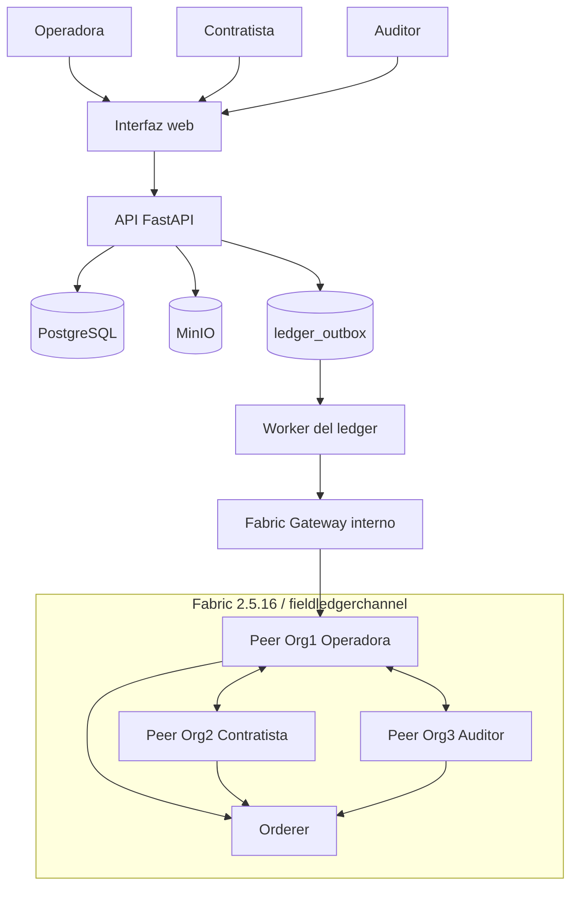
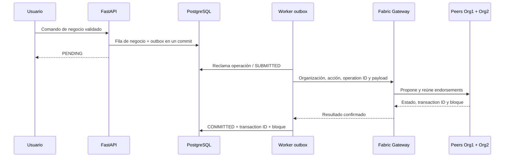
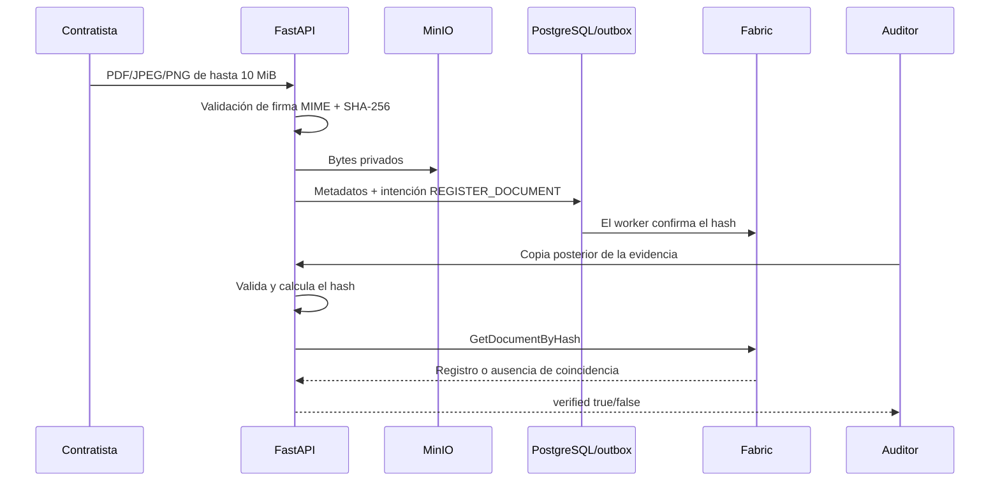
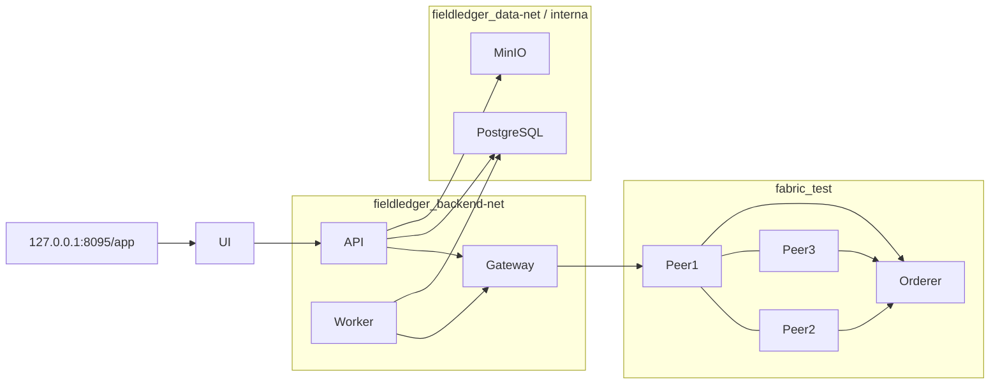

# Arquitectura de FieldLedger

## Propósito y límite de confianza

FieldLedger permite que organizaciones que comparten responsabilidad sobre
activos de Oil & Gas verifiquen hechos críticos de mantenimiento sin colocar
bases operativas, documentos o telemetría de alta frecuencia en una blockchain.

Utiliza deliberadamente tres almacenes:

- PostgreSQL para los datos de negocio actuales y la intención de entrega;
- MinIO para los bytes privados de documentos;
- Hyperledger Fabric para hechos compactos que requieren un historial
  compartido y resistente a alteraciones entre OperatorOrg, ContractorOrg y
  AuditorOrg.

Fabric se justifica únicamente en ese límite entre organizaciones. Si existiera
un solo escritor confiable, podrían bastar controles de auditoría en PostgreSQL.

## Contexto del sistema implementado



El gateway es un proceso TypeScript pequeño. Administra el SDK y los
certificados de Fabric; FastAPI administra autenticación, validación, workflow
y autorización de la aplicación.

La interfaz web es HTML/CSS/JavaScript nativo servido por FastAPI. Comparte
origen con la API, no necesita CORS, build, contenedor o puerto propio y respeta
los mismos permisos de backend.

## Ubicación de los datos

| Datos | Sistema | Motivo |
|---|---|---|
| Usuarios, activos, eventos y workflow | PostgreSQL | Transacciones, filtros, relaciones y actualizaciones |
| Intención y resultado de entrega al ledger | Outbox PostgreSQL | Atomicidad, reintento y observabilidad |
| PDF, imágenes y certificados | MinIO | Ciclo de vida binario privado y control de acceso |
| IDs y decisiones de activos/eventos | Fabric | Historial compartido y endorsement |
| SHA-256 documental y metadatos compactos | Fabric | Evidencia de integridad entre organizaciones |
| Telemetría cruda | Futuro PostgreSQL/serie temporal | Volumen alto y consultas por rango |
| Hash canónico de lote de telemetría | Futuro Fabric | Integridad sin una transacción por lectura |

El ledger nunca guarda contraseñas, JWT, claves de objeto MinIO, documentos
completos ni lecturas crudas de sensores.

## Identidades y endorsement

Las identidades de aplicación y ledger están separadas:

- Argon2/JWT identifica al usuario y carga su rol actual.
- Los certificados X.509 identifican a OperatorOrg (`Org1MSP`), ContractorOrg
  (`Org2MSP`) o AuditorOrg (`Org3MSP`) ante Fabric.
- El gateway relaciona una operación ya validada con la identidad montada de
  la organización correspondiente.
- El chaincode autoriza por MSP del certificado, nunca por un rol enviado por
  el caller.

La definición del chaincode usa:

```text
AND('Org1MSP.peer','Org2MSP.peer')
```

Ambos peers operativos deben avalar las mutaciones. AuditorOrg pertenece al
canal y puede consultar, pero no integra la regla de escritura en este MVP.

## Modelo de consistencia y fallas



Si gateway o Fabric fallan, la fila pasa a `FAILED` con un próximo reintento
acotado. Se reutiliza el mismo ID determinista. El chaincode guarda el digest
SHA-256 del payload, acepta una repetición idéntica y rechaza datos cambiados
bajo el mismo ID.

PostgreSQL sigue siendo la fuente operativa inmediata. `COMMITTED` significa
que Fabric confirmó el commit; nunca se asigna solo porque el dato exista
localmente.

## Camino documental



Una caída de consulta devuelve HTTP 502 y nunca una verificación basada solo
en la base de datos.

## Redes del despliegue



- Solo FastAPI se publica en el host y se vincula a loopback.
- Los puertos administrativos de Fabric también se vinculan a loopback.
- Gateway, PostgreSQL y MinIO no publican puertos de servicio en el host.
- No existe ruta pública por router, Cloudflare, Tailscale Serve o Funnel.
- API y gateway usan raíz de solo lectura y `no-new-privileges`.
- Peers/orderer, gateway, worker, API, PostgreSQL y MinIO tienen políticas de
  reinicio adecuadas para el laboratorio en un único host.

El kernel de la Pi ignora los límites Docker porque memory cgroups está
deshabilitado. Esos límites documentan intención, pero no se aplican.

## Persistencia y backups

PostgreSQL y MinIO usan volúmenes Docker nombrados sobre la SD. Los volúmenes
de peers/orderer y las identidades generadas también están en la SD. Los
backups primarios viven en `/home/pi/fieldledger/backups` e incluyen
manifiestos SHA-256.

El HDD conectado tiene daño físico comprobado y también se reinicia al escribir
en una región legible. Está desvinculado, desmontado y en cuarentena persistente
hasta su reemplazo físico. No contiene datos de FieldLedger. Los backups
permanecen en la SD; el preflight reserva 10 GiB y `make storage-status`
advierte por debajo de 15 GiB. No se permite borrado automático por retención.

## Fases implementadas y planificadas

1. **Base — completa:** Pi dedicada, repositorio, PostgreSQL, MinIO, FastAPI,
   Alembic, CRUD de activos, JWT/RBAC, documentos y backups.
2. **Backend ledger — completo:** red Fabric de tres organizaciones, chaincode,
   gateway privado, outbox/worker, reconciliación y verificación real.
3. **Experiencia web MVP — implementada:** login, activos, workflow, evidencia,
   estado del ledger y verificación. Falta la aceptación visual manual y
   material de demostración.
4. **Telemetría — próxima después de aceptar la UI:** Mosquitto, simulador,
   worker, lecturas, lotes canónicos y anclajes selectivos en Fabric.
5. **Observabilidad/DevOps:** métricas, dashboards, alertas, CI y scanning.
6. **Endurecimiento empresarial:** infraestructura independiente, ciclo de
   vida CA/HSM, OIDC, TLS, rate limits, HA, DR, gobierno y revisión de seguridad.
7. **Edge:** gateway Raspberry y buffering offline donde el campo lo requiera.

Ninguna fase se considera terminada hasta que su camino real end-to-end pase
sin éxitos hardcodeados ni mocks dentro del flujo de ejecución.
